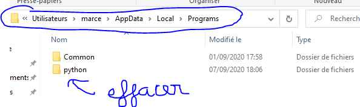
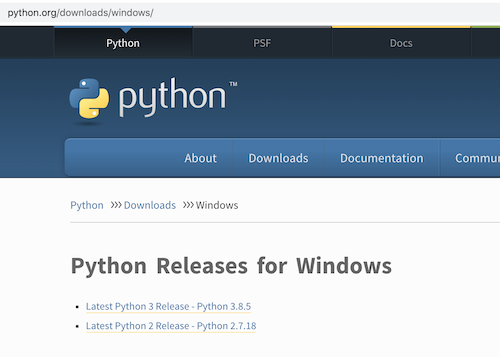
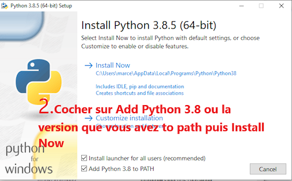
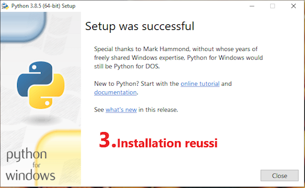
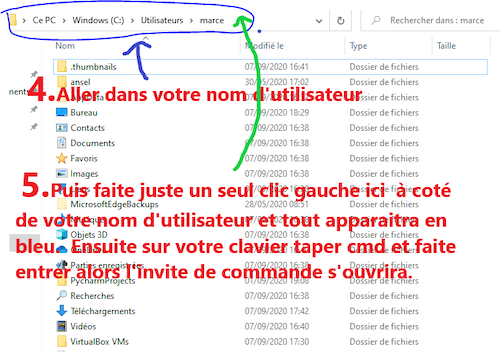
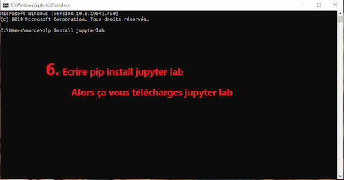
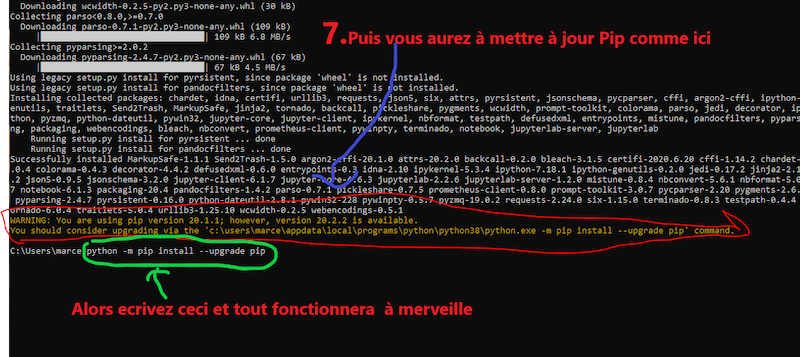
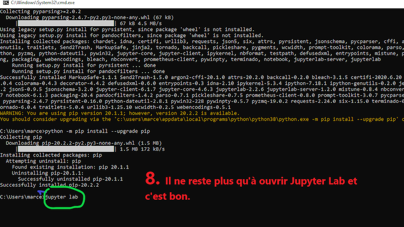
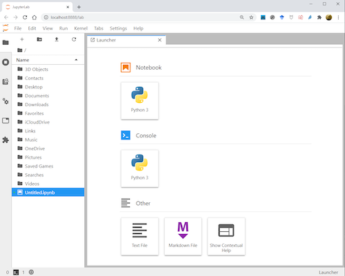

# Installation de Jupyter Lab

Voici les étapes à suivre pour installer Jupyter Lab. **Attention** si vous avez déjà installé Python, il vous faut commencer par le désinstaller.

Ce tutoriel vous est proposé par Camille Marcel Javel, étudiant en L1 Informatique.


## Désinstaller votre Python...

et supprimer le dossier Python s'il existe 



## Installation de Jupyter Lab


### Télécharger Python...

Sur le site officiel : http://python.org/downloads/ prenez la dernière version, en tout cas une version $\geq$ 3.6



### Lancer l'installation...

**Attention** bien cocher la case `Add Python ... to PATH` puis cliquer sur `Install Now`



### Installation réussie...

Vous pouvez fermer la fenêtre de Setup



### Lancer une invite de commandes...

Il y a plusieurs façons de faire. En voici une décrite par l'auteur de ce tuto :




Ou alors (windows 10) : rechercher "Invite de commandes" dans l'outil de recherche en bas du bureau, comme ci-dessous :


### Taper la commande pour installer...

Dans l'invite de commandes, taper la commande :

```bash
pip install jupyterlab
```

**Attention** `jupyterlab` est en 1 seul mot !




### Etape OPTIONNELLE : mettre à jour pip

**Vous pouvez passer cette étape**. Elle sert à mettre à jour votre outil `pip` s'il ne l'est pas. 



### Lancer Jupyter Lab...

Toujours dans l'invite de commandes, taper la commande suivante :

```bash
jupyter lab 
```

**Attention** cette fois il y a bien une espace entre `jupyter` et `lab`



Cela devrait vous ouvrir votre navigateur avec une page similaire à :


